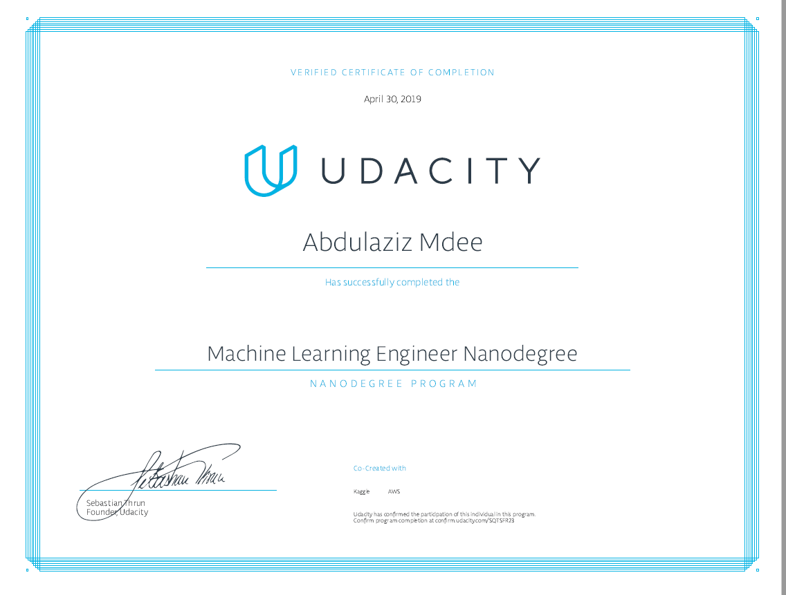

# [Machine Learning Engineer Nanodegree](https://www.udacity.com/course/machine-learning-engineer-nanodegree--nd009t)

---

## About

This repisitory contains all my projects for [Machine Learning Engineer Nanodegree](https://www.udacity.com/course/machine-learning-engineer-nanodegree--nd009t).

## Syllabus

### Prerequisites

In order to succeed in this program, we recommend having experience programing in
Python, knowledge of inferential statistics, probability, linear algebra and calculus. If you’ve never
programmed before, or want a refresher, you can prepare for this Nanodegree with Lessons 1-4 of [Intro to
Computer Science](https://www.udacity.com/course/intro-to-computer-science--cs101) .

### Educational Objectives

This program will teach you how to become a Machine Learning Engineer, build
Machine Learning models and apply them to data sets in fields like finance, healthcare, education, and
more.
Length of Program: The program is divided into two terms of 3 months each. We expect students to work
10 hours/week on average. Estimated time commitment to complete both terms is 200 hours.
*The length is an estimation of total hours the average student may take to complete all required
coursework, including lecture and project time. Actual hours may vary.
Instructional Tools Available: Video lectures, personalized project reviews, dedicated mentor

## Projects

* [Project 0: Titanic Survival Exploration](#Titanic-Survival-Exploration)
* [Project 1: Predicting Boston Housing Prices](#Predicting-Boston-Housing-Prices)
* [Project 2: Finding Donors for CharityML](#Finding-Donors-for-CharityML)
* [Project 3: Creating Customer Segments](#Creating-Customer-Segments)
* [Project 4: Dog Breed Classifier](#Dog-Breed-Classifier)
* [Project 5: Train a Quadcopter to Fly](#Train-a-Quadcopter-to-Fly)
* [Project 6: Capstone Proposal](#Capstone-Proposale)
* [Project 7: Capstone Project](#Capstone-Project)
* [Supplemental Course Materials](#Supplemental-Course-Materials)

---

### [Titanic Survival Exploration](/Titanic Survival Exploration/)

  
View Details

In this practice project, you will create decision functions that attempt to predict survival outcomes from the 1912 Titanic disaster based on each passenger’s features, such as sex and age. You will start with a simple algorithm and increase its complexity until you are able to accurately predict the outcomes for at least 80% of the passengers in the provided data. This project will introduce you to some of the concepts of machine learning as you start the Nanodegree program.

In addition, you'll make sure Python is installed with the necessary packages to complete this project. There are two Python libraries, numpy and pandas, that we'll use a bit here in this project. Don't worry about how these libraries work for now — we'll get to them in more detail in later projects. This project will also familiarize you with the submission process for the projects that you will be completing as part of the Nanodegree program.

---

### Predicting Boston Housing Prices

  
View Details

#### Model Evaluation and Validation

The Boston housing market is highly competitive, and you want to be the best real estate agent in the
area. To compete with your peers, you decide to leverage a few basic machine learning concepts toassist you and a client with finding the best selling price for their home. Luckily, you’ve come across the
Boston Housing dataset which contains aggregated data on various features for houses in Greater
Boston communities, including the median value of homes for each of those areas. Your task is to build
an optimal model based on a statistical analysis with the tools available. This model will then be used to
estimate the best selling price for your clients' homes.

Supporting Lesson Content: Model Evaluation and Validation

| Lesson Title                 | Learning Outcomes                                                     |
| ---------------------------- | --------------------------------------------------------------------- |
|TRAINING AND TESTING Modelsl  | ➔ Load data with Pandas, then train and test models with Scikit-learn.  |
| EVALUATION METRICS           | ➔ Learn about metrics such as accuracy, precision, and recall used to measure the                                    performance of your models.      |
|EVALUATION AND VALIDATION| ➔ Choose the best model using cross-validation and grid search.)|

---

### Finding Donors for CharityML

  
View Details

#### Supervised Learning

CharityML is a fictitious charity organization located in the heart of Silicon Valley that was established to
provide financial support for people eager to learn machine learning. After nearly 32,000 letters sent to
people in the community, CharityML determined that every donation they received came from
someone that was making more than $50,000 annually. To expand their potential donor base,
CharityML has decided to send letters to residents of California, but to only those most likely to donate
to the charity. With nearly 15 million working Californians, CharityML has brought you on board to help
build an algorithm to best identify potential donors and reduce overhead cost of sending mail. Your
goal will be evaluate and optimize several different supervised learners to determine which algorithm
will provide the highest donation yield while also reducing the total number of letters being sent.

#### Supporting Lesson Content: Supervised Learning

| Lesson Title                 | Learning Outcomes                                                     |
| ---------------------------- | --------------------------------------------------------------------- |
|LINEAR REGRESSION  | ➔ Difference between Regression and Classificationt-learn. ➔ Learn to predict values withLinear Regression |
| PERCEPTRON ALGORITHM          | ➔ Learn the definition of a perceptron as a building block for neural networks, and the perceptron algorithm for classification.|
|LOGISTIC REGRESSION| ➔ Learn to predict states using Logistic Regression|
|NEURAL NETWORKS| ➔ Learn the definition of a Neural Network
||                ➔ Learn to train them using backpropagation
||                ➔ Build a neural network starting from a single perceptron|
|DECISION TREES|  ➔ Train Decision Trees to predict states
||                ➔ Use Entropy to build decision trees recursively
||                ➔ Random forests|
|NAIVE BAYES|     ➔ Learn the Bayes rule, and how to apply it to predicting data using the Naive Bayes algorithm
||                ➔ Train models using Bayesian Learning
||                ➔ Use Bayesian Inference to create Bayesian Networks of several variables
||                ➔ Bayes NLP Mini-Project|
|SUPPORT VECTOR MACHINES| ➔ Learn to train a Support Vector Machine to separate data linearly
||                        ➔ Use Kernel Methods in order to train SVMs on data that is not linearly separable|
|ENSEMBLE OF LEARNERS| ➔ Enhance traditional algorithms via boosting
||                     ➔ AdaBoost|

---

### Creating Customer Segments

  
View Details

#### Unsupervised Learning

In this project you will apply unsupervised learning techniques on product spending data collected for
customers of a wholesale distributor in Lisbon, Portugal to identify customer segments hidden in the
data. You will first explore the data by selecting a small subset to sample and determine if any product
categories highly correlate with one another. Afterwards, you will preprocess the data by scaling each
product category and then identifying (and removing) unwanted outliers. With the good, clean
customer spending data, you will apply PCA transformations to the data and implement clustering
algorithms to segment the transformed customer data. Finally, you will compare the segmentation
found with an additional labeling and consider ways this information could assist the wholesale
distributor with future service changes.

| Lesson Title                 | Learning Outcomes                                                     |
| ---------------------------- | --------------------------------------------------------------------- |
|CLUSTERING| ➔ Learn the basics of clustering Data
||           ➔ Cluster data with the K-means algorithm|
|HIERARCHICAL AND DENSITY-BASED CLUSTERING| ➔ Cluster data with Single Linkage Clustering
||                                          ➔ Cluster data with DBSCAN, a clustering method that captures the insight that clusters are dense groups of points.|
|GAUSSIAN MIXTURE MODELS|  ➔ Cluster data with Gaussian Mixture Models
||                         ➔ Optimize Gaussian Mixture Models with Expectation Maximization|
|FEATURE SCALING|          ➔ Learn to scale features in your data
||                         ➔ Learn to select the best features for training data|
|DIMENSIONALITY REDUCTION| ➔ Reduce the dimensionality of the data using Principal Component Analysis and Independent Component Analysis|

---

### Dog Breed Classifier

  
View Details

In this project, you will learn how to build a pipeline that can be used within a web or mobile app to process
real-world, user-supplied images. Given an image of a dog, your algorithm will identify an estimate of the
canine’s breed. If supplied an image of a human, the code will identify the resembling dog breed. Along with
exploring state-of-the-art CNN models for classification, you will make important design decisions about the
user experience for your app. Our goal is that by completing this lab, you understand the challenges
involved in piecing together a series of models designed to perform various tasks in a data processing
pipeline. Each model has its strengths and weaknesses, and engineering a real-world application often
involves solving many problems without a perfect answer. Your imperfect solution will nonetheless create a
fun user experience!

| Lesson Title                 | Learning Outcomes                                                     |
| ---------------------------- | --------------------------------------------------------------------- |
|MACHINE LEARNING TO DEEP LEARNING| ➔ The basics of deep learning, including softmax, one-hotencoding, and crossentropy.
||                                  ➔ Basic linear classification models such as Logistic Regression,and their associated error function.|
|DEEP NEURAL NETWORKS| ➔ Review: What is a Neural Network?
||                     ➔ Activation functions, sigmoid, tanh, and ReLus.
||                     ➔ How to train a neural network using backpropagation and thechain rule.
||                     ➔ How to improve a neural network using techniques such as regularization and dropout.
|CONVOLUTIONAL NEURAL NETWORKS| ➔ What is a Convolutional Neural Network?
||                              ➔ How CNNs are used in image recognition.|

---

### Train a Quadcopter to Fly

  
View Details

In this project, you will design an agent that can fly a quadcopter, and then train it using a reinforcement
learning algorithm of your choice, You will apply the techniques you have learnt in this module to find out
what works best, but you will also have the freedom to come up with innovative ideas and test them on your
own. The project is divided into 4 sections which cover different aspects of getting the quadcopter to fly
such as taking off, hovering, landing and so on.

| Lesson Title                 | Learning Outcomes                                                     |
| ---------------------------- | --------------------------------------------------------------------- |
|WELCOME TO RL|             ➔ The basics of reinforcement learning and OpenAI Gym.|
|THE RL FRAMEWORK: THE PROBLEM| ➔ Learn how to define Markov Decision Processes to solve real-world problems.|
|THE RL FRAMEWORK: THE SOLUTION|➔ Learn about policies and value functions.
||                              ➔ Derive the Bellman Equations.|
|DYNAMIC PROGRAMMING| ➔ Write your own implementations of iterative policy evaluation, policy improvement, policy Iteration, and value Iteration.|
|MONTE CARLO METHODS| ➔ Implement classic Monte Carlo prediction and control methods.
||                    ➔ Learn about greedy and epsilon-greedy policies.
||                    ➔ Explore solutions to the Exploration-Exploitation Dilemma.|
|TEMPORAL-DIFFERENCE METHODS| ➔ Learn the difference between the Sarsa, Q-Learning, and Expected Sarsa algorithms.|
|RL IN CONTINUOUS SPACES| ➔ Learn how to adapt traditional algorithms to work withcontinuous spaces.|
|DEEP Q-LEARNING| ➔ Extend value-based reinforcement learning methods to complex problems using deep neural networks|
|POLICY GRADIENTS| ➔ Policy-based methods try to directly optimize for the optimal policy. Learn how they work, and why they are important,especially for domains with continuous action spaces.|
|ACTOR-CRITIC METHODS| ➔ Learn how to combine value-based and policy-based methods,bringing together the best of both worlds, to solve challenging reinforcement learning problems.|

---

### Capstone Proposal

  
View Details

In this capstone project proposal, prior to completing the following Capstone Project, you you will leverage
what you’ve learned throughout the Nanodegree program to author a proposal for solving a problem of
your choice by applying machine learning algorithms and techniques. A project proposal encompasses
seven key points:
● The project's domain background — the field of research where the project is derived;
● A problem statement — a problem being investigated for which a solution will be defined;
● The datasets and inputs — data or inputs being used for the problem;
● A solution statement — a the solution proposed for the problem given;
● A benchmark model — some simple or historical model or result to compare the defined solution to;
● A set of evaluation metrics — functional representations for how the solution can be measured;
● An outline of the project design — how the solution will be developed and results obtained.

---

### Capstone Project

  
View Details

In this capstone project, you will leverage what you’ve learned throughout the Nanodegree program to solve
a problem of your choice by applying machine learning algorithms and techniques. You will first define the
problem you want to solve and investigate potential solutions and performance metrics. Next, you will
analyze the problem through visualizations and data exploration to have a better understanding of what
algorithms and features are appropriate for solving it.
You will then implement your algorithms and metrics of choice, documenting the preprocessing,
refinement, and postprocessing steps along the way. Afterwards, you will collect results about the
performance of the models used, visualize significant quantities, and validate/justify these values. Finally,
you will construct conclusions about your results, and discuss whether your implementation adequately
solves the problem.

---

### Supplemental Course Materials

  
View Details

1. [Intro to Descriptive Statistics](https://www.udacity.com/course/intro-to-descriptive-statistics--ud827)
1. [Intro to Data Science](https://www.udacity.com/course/intro-to-data-science--ud359)
1. [Intro to Artificial Intelligence](https://www.udacity.com/course/intro-to-artificial-intelligence--cs271)
1. [Reinforcement Learning](https://www.udacity.com/course/reinforcement-learning--ud600)
1. [Deep Learning](https://www.udacity.com/course/deep-learning--ud730)
1. [Artificial Intelligence for Robotics](https://www.udacity.com/course/artificial-intelligence-for-robotics--cs373)
1. [Machine Learning for Trading](https://www.udacity.com/course/machine-learning-for-trading--ud501)

---
